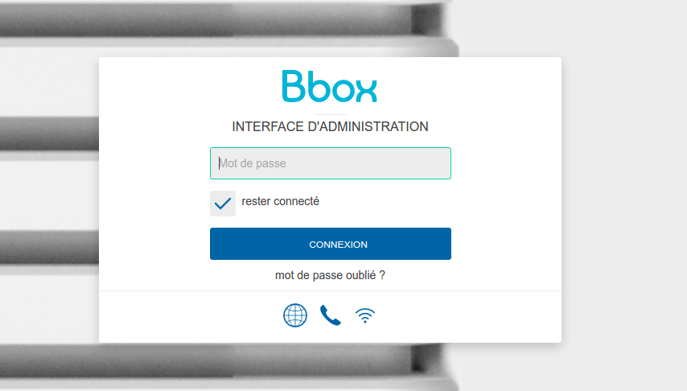

# BboxApi Router client library #

[](https://travis-ci.org/bertrandmartel/bboxapi-router)
[ ](https://bintray.com/bertrandmartel/maven/bboxapi-router/_latestVersion)
[](https://maven-badges.herokuapp.com/maven-central/fr.bmartel/bboxapi-router)
[](http://javadoc-badge.appspot.com/fr.bmartel/bboxapi-router)
[](LICENSE.md)

Java/Android client library for [Bbox Router API](https://api.bbox.fr/v1/doc/apirouter/index.html)

These APIs are used by Bbox management interface on : http://gestionbbox.lan

## List of API implemented

| api     | prototype        |   access      | comment
|--------------|---------|-----|------------------------|
| summary | ``getDeviceSummary()`` |  public    | get some information about Bbox      |
| voip | ``getVoipData()`` |  private    | request voip data      |
| device information | ``getDeviceInfo()`` |  private    | request specific information about box      |
| full call log | ``getFullCallLog()`` |  private    | get call log since last reboot      |
| hosts | ``getHosts()`` |  private    | request list of known hosts      |
| set wifi state | ``setWifiState(boolean state)`` |  private    | set Wifi ON/OFF      |
| set led state | ``setBboxDisplayState(boolean state)`` |  private    | set Bbox led display ON/OFF      |
| dial | ``voipDial(int lineNumber, String phone)`` |  private    | dial a phone number on a line      |
| wireless | `getWirelessData()` | private | get wireless info |

All APIs need authentication (admin password) except Summary API

## Include into your project

* with Gradle, from JCenter or MavenCentral :

```
compile 'fr.bmartel:bboxapi-router:1.3'
```

## Usage

### Summary 

Retrieve some basic information about Bbox :

```
BboxApi api = new BboxApi();

SummaryResponse summaryResponse = api.getDeviceSummary();
```

This API is public (doesn't require authentication), for more precise info see Device Info API

## Device info

Get more information about Bbox : 

```
BboxApi api = new BboxApi();

api.setPassword("password");

DeviceInfoResponse deviceInfoResponse = api.getDeviceInfo();
```

## Hosts

Get list of all hosts known by Bbox :

```
BboxApi api = new BboxApi();

api.setPassword("password");

HostsResponse hostResponse = api.getHosts();
```

## Wireless

Get information about wireless :

```
BboxApi api = new BboxApi();

api.setPassword("password");

WirelessResponse wirelessResponse = api.getWirelessData();
```

## Voip

Get voip information :

```
BboxApi api = new BboxApi();

api.setPassword("password");

VoipResponse voipResponse = api.getVoipData();
```

## Call Log list

Get full list of call log since last reboot :

```
BboxApi api = new BboxApi();

api.setPassword("password");

CallLogResponse callLogResponse = api.getFullCallLog();
```

## Dial a phone number

Dial a specified phone number. Phone will ring and call will be processed once user hookoff

```
BboxApi api = new BboxApi();

api.setPassword("password");

api.voipDial(1, "0123456789");
```

Input  :

* line number (int) : 1 or 2 according to the line on which you plugged your phone
* phone number (String) : number to call

## Set Bbox led state

Switch led display to ON / OFF on Bbox 

```
BboxApi api = new BboxApi();

api.setPassword("password");

// turn off led display
api.setBboxDisplayState(false);

// turn on led display
api.setBboxDisplayState(true);
```

## Set Wifi state

Switch Wifi to ON/OFF 

```
BboxApi api = new BboxApi();

api.setPassword("password");

// turn on Wifi
api.setWifiState(true);

// turn off Wifi
api.setWifiState(false);
```

## Android integration

* add `bboxapi-router` & `httpcomponents` lib depedency to `build.gradle` : 

```
compile 'org.apache.httpcomponents:httpclient-android:4.3.5.1'
compile 'fr.bmartel:bboxapi-router:1.3'
```

* add Internet permission to manifest :

```
<uses-permission android:name="android.permission.INTERNET" />
```

* use an AsyncTask to call Bbox Router API :

```
public class BboxApiTask extends AsyncTask<Void, Void, String> {

    @Override
    protected String doInBackground(Void... params) {

        BboxApi api = new BboxApi();

        SummaryResponse summaryResponse = api.getDeviceSummary();

        if (summaryResponse.getStatus() == HttpStatus.OK) {

        	// print summary JSON result (deserialized)
            GsonBuilder gsonBuilder = new GsonBuilder();
            Gson gson = gsonBuilder.setPrettyPrinting().create();
            Type listOfTestObject = new TypeToken<List<ApiSummary>>() {
            }.getType();
            String summary = gson.toJson(summaryResponse.getSummary(), listOfTestObject);

            Log.v("bboxapi", summary);
        } else {
            Log.e("bboxapi", "http error  : " + summaryResponse.getStatus());
        }

        return null;
    }
}

```

Execute it with : `new BboxApiTask().execute();`

## Examples

The following examples will prompt user for password and execute specified request (except for summary which doesnt require authentication) :

* Call log :
```
./gradlew callLog
```
* Device info :
```
./gradlew deviceInfo
```
* Dial phone number (phone number will be asked) :
```
./gradlew dial
```
* Toggle ON/OFF led display for 10sec :
```
./gradlew display
```
* list hosts :
```
./gradlew hosts
```
* logout :
```
./gradlew logout
```
* summary request :
```
./gradlew summary
```
* voip request :
```
./gradlew voip
```
* set wifi to ON :
```
./gradlew wifi
```
* request wireless info :
```
./gradlew wireless
```

You can test Bbox API with a Linux Bash script ``bboxapi-curl.sh`` script performing authentication, request voip data and dial a number.

Usage :
```
./bboxapi-curl.sh <your_password> <phone_number>
```

## Issues

If you can't reach http://gestionbbox.lan interface (see picture below) on your local network (Bbox), it means your box doesn't have the latest version and you can't use these APIs right now



## External Library

* [Apache HttpComponents](https://hc.apache.org)
* [GSON](https://github.com/google/gson)

## API documentation

https://api.bbox.fr/v1/doc/apirouter/index.html

## License

The MIT License (MIT) Copyright (c) 2017 Bertrand Martel
